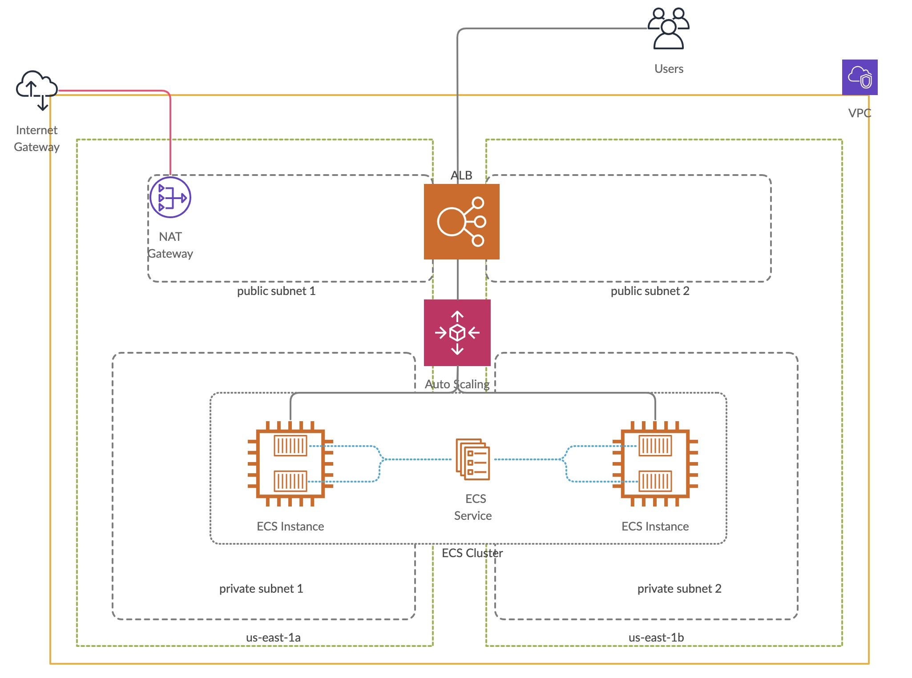

# ECS Cluster to deploy web application in Nginx

## Architecture

## About this terraform
This terraform script is used to spin ECS Container Instances and run nginx containers in it.

## Infrastructure
1. VPC
2. Public subnet - 2
3. Private subnet - 2
4. Internet Gateway
5. EIP and NAT Gateway
6. IAM Policies
7. ALB - Application Load Balancer
8. ECS Cluster - Which spins Autoscaling group
9. ECS Instances
10. ECS task definition - which has container information
11. ECS Service - which makes sure necessary tasks are running properly

## Features
ALB is only placed in public subnet in multi-az mode (us-east-1a and us-east-1b) which provides HA and Security Features.
ECS Instances are placed in private subnet and instance security group is modified like only traffic from ALB is allowed to instances which provides added security to the instances.
Autoscaling is placed in the ECS container instances which spins up new machine when there is high load in the application.
